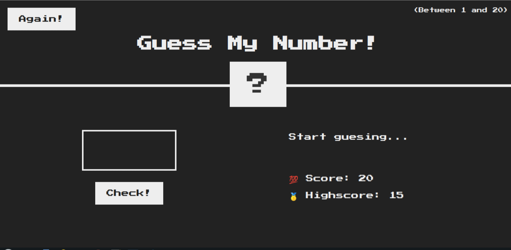
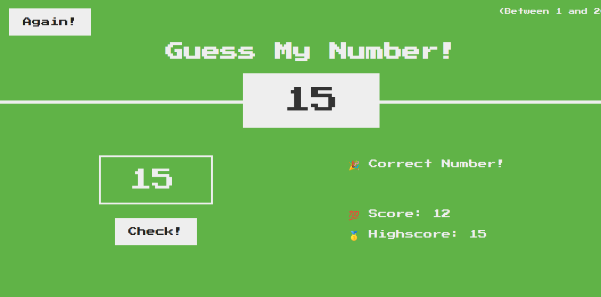

## 🔢 Guess My Number 🔢 ##
The game is between a computer and a player. The computer selects a random integer within a known range (Between 1 and 20). The player tries to guess the number.
If the guess is incorrect, then the computer display whether the guess was too high or too low. Developed using `HTML`, `CSS` and `JavaScript`. 
##### Link:  [Guess My Number](https://gautam3333.github.io/Guess-Number/)
___
### Screenshots
---

